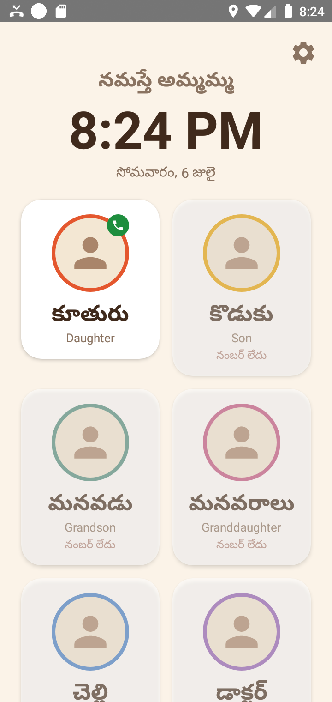
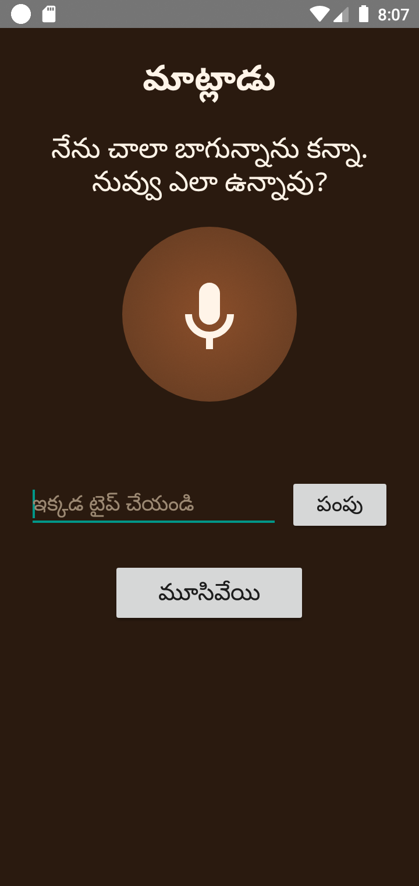
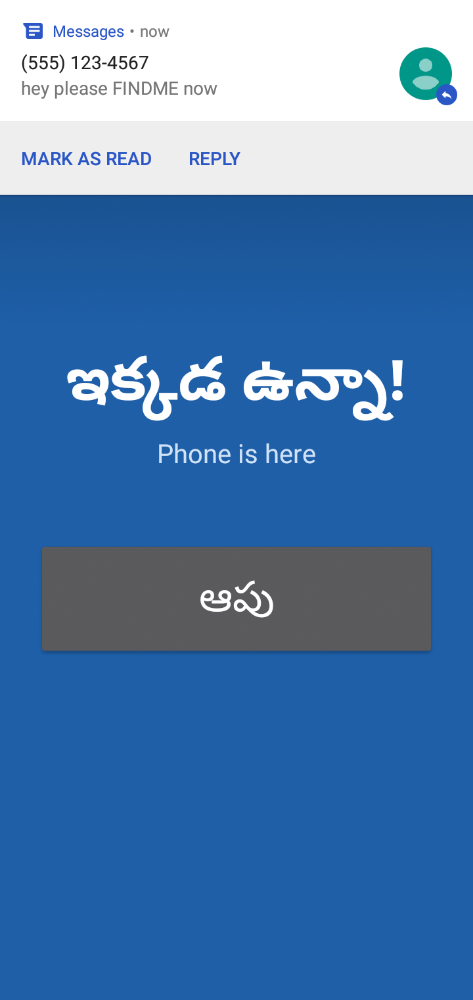

# అమ్మమ్మ తోడు · Ammamma's Phone Partner

> Turning an old phone into a talking companion for an elderly Telugu-speaking grandmother.
> **Offline-first. Audio-first. Built for someone who cannot read the screen.**

An elderly woman said she would save money to buy a new phone, just to have a voice
companion. She shouldn't have to. This app turns the phone she *already owns* — an old
Oppo running Android 8.1 — into the thing she wished for: a phone that talks to her, tells
her who's calling, watches her battery, and (when there's internet) chats with her, all in
Telugu.

<p align="center">
  
  
  
</p>

## Who it's for

- Elderly, Telugu only, reads screen text unreliably → **audio-first, huge photo buttons, colour over words**
- Uses the phone only for calls; no apps, no internet habit
- The phone should feel like a small partner she loves, not a gadget she fears

## What it does — all offline

| Feature | What she experiences |
|---|---|
| 📞 **Caller announcement** | The phone *says who is calling* in Telugu — "కూతురు ఫోన్ చేస్తున్నారు" (Daughter is calling) |
| 🖼️ **Photo dial** | A grid of big face-buttons. One tap on a face places the call. No dial pad, no menus. |
| 🔋 **Battery partner** | Speaks the level + a giant card at 20% / 10% ("ఛార్జ్ చేయండి"), and when full ("ఛార్జర్ తీసేయండి") |
| ⚡ **Charging status** | Live screen with battery %, health, and estimated time-to-full — spoken aloud |
| 🔎 **Find my phone (by SMS)** | A family member texts a code word → the phone rings loudly even on silent |
| 📍 **Grandpa finder** | The same SMS makes the phone text back its GPS location as a map link |
| 🗣️ **Talk companion** *(needs internet — the "cherry")* | She speaks or types; a warm Telugu AI replies and it's spoken back |

<p align="center">
  
  
</p>

Everything except the optional AI works with **zero internet**. When there's no connection,
the app never shows an error — it simply falls back to what works.

## Design principles

- **Recognition over reading** — faces and colours, not text she must decode
- **One tap, one job** — a card calls; a giant button dismisses; nothing hidden in menus
- **Warm, not childish** — she's clever; the app shows real information (percentages, health, who's calling), just clearly and large
- **Reliability > cleverness** — a foreground service keeps it alive on ColorOS, which kills background apps aggressively
- **Family voices** — every spoken line can be replaced by a recorded family-member clip, with no code change (drop an audio file in `filesDir/clips/<key>`)

## Tech notes

- Native **Kotlin**, single module, `minSdk 26`, `targetSdk 27` (matches the device so Android applies the old, simpler rules the phone expects)
- **No third-party libraries** — pure Android framework + Kotlin stdlib, so the APK is tiny (~0.6 MB) and nothing breaks on Android 8
- Voice: recorded clips first, then Android **TextToSpeech** (Telugu); speech input via **SpeechRecognizer**
- Optional AI: **OpenRouter** free models (text) over plain `HttpURLConnection`; key stored only on the device

## Install (sideload)

This app is **not** on the Play Store — it targets Android 8.1 on purpose. Grab the signed
APK from [**Releases**](../../releases), copy it to the phone (e.g. via Telegram → Saved
Messages), open it, allow "install unknown apps", and install. On first launch, tap **Allow**
on the permission prompts (calls, phone state, SMS). Long-press the ⚙️ gear to add real
numbers to the faces.

## Build from source

```bash
./gradlew assembleDebug     # debug APK
./gradlew assembleRelease   # signed release (needs keystore.properties + keystore, not committed)
```

## License

[MIT](LICENSE) · Made with care, and with [Claude Code](https://claude.com/claude-code).
